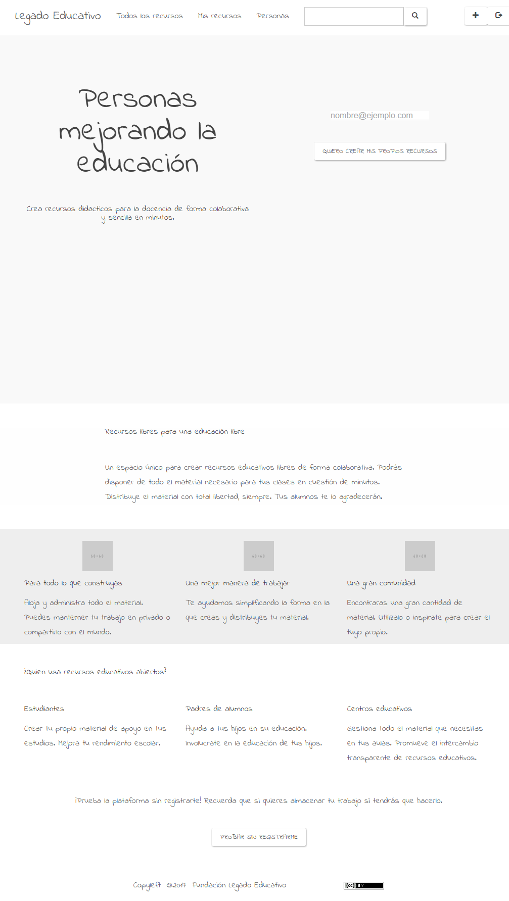
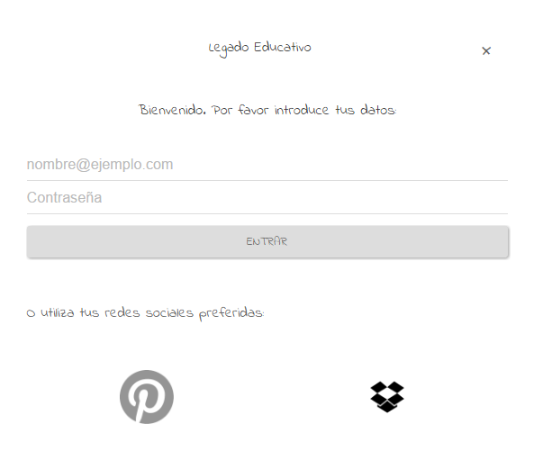
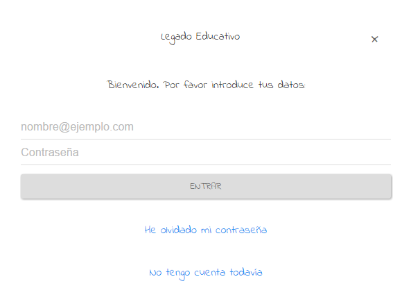
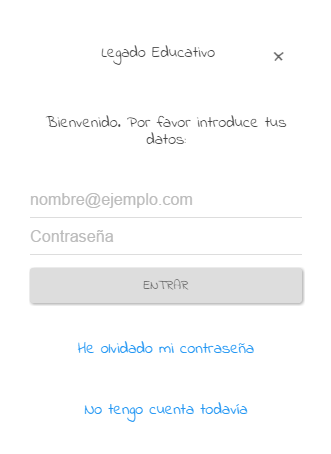
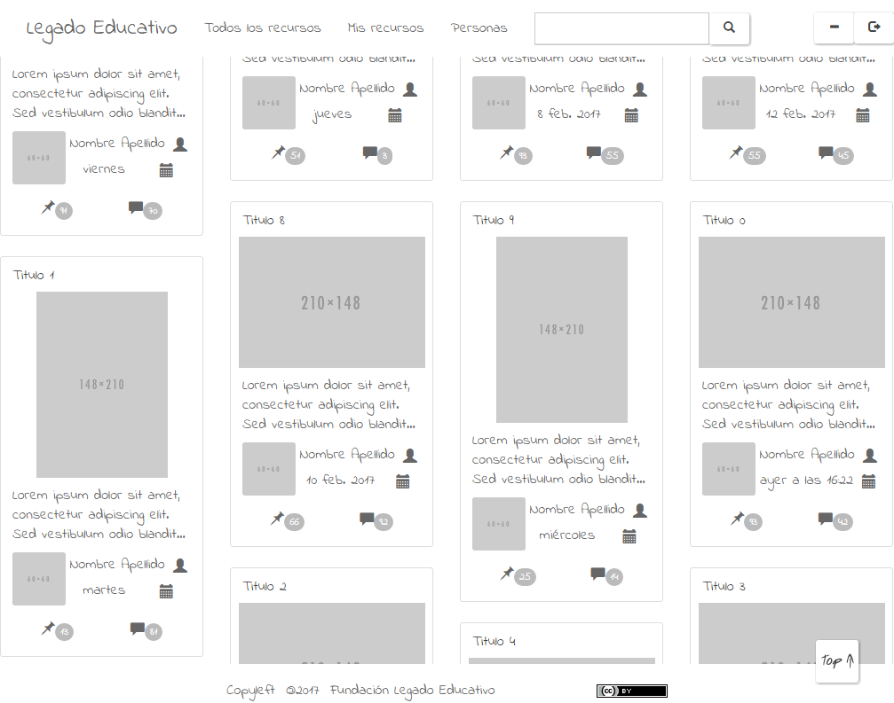
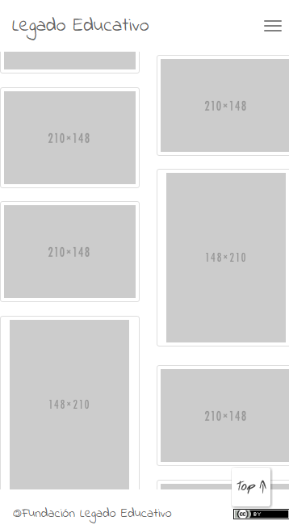
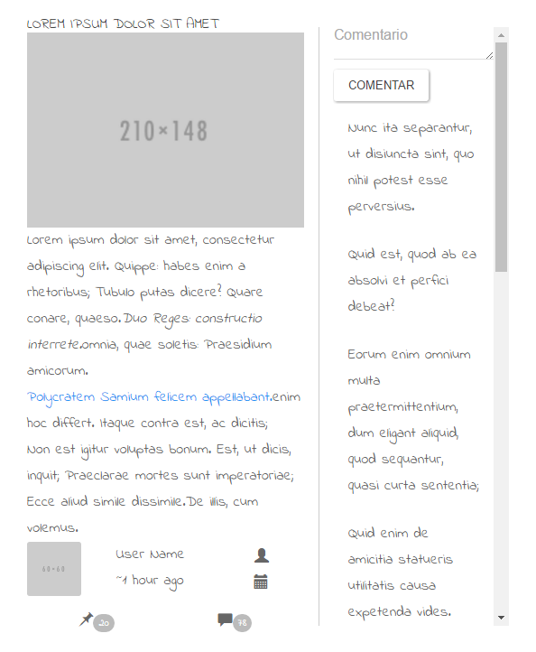
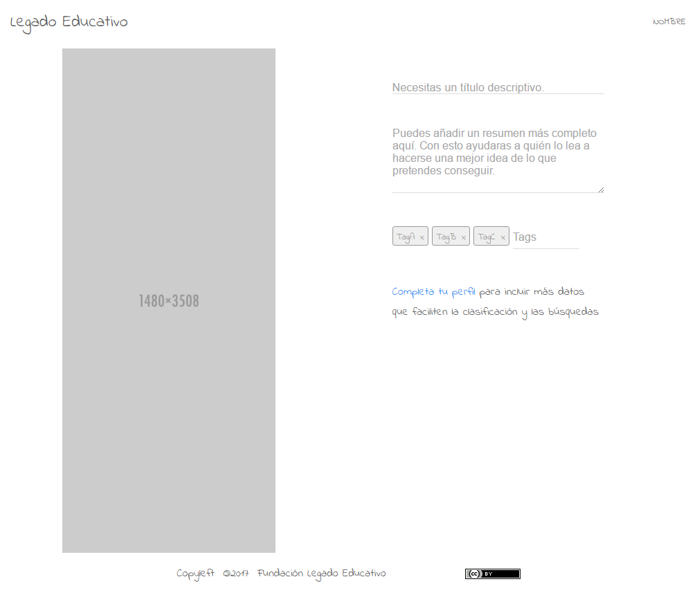

# Overview

## Project Overview

To be aware of the importance of a design minded development.

Create didactic resources for teaching in a collaborative and simple way in minutes.

__[LegadoEducativo](http://legadoeducativo.org)__ helps you to find _Open Educational Resources_, a place full of content ready to use in your classroom.

Traditional textbooks are expensive. Have you try to use your own material?

Find suitable content is difficult. Our OER platform make it easy!

Producing material is a time consuming tasks. Create, share, collaborate. It has never been so quick!

# Customer Target

## Primary School Teacher

* Concerned about challenges facing public education.
* Follower of Student Centered Learning methods.
* Have some experience level with technology.
* Using Pinterest as main application for share this kind of resources.
* Only uses the platform proposed by the government educa.madrid.org when it is forced to do so.
* Look with admiration and envy at the job done by other countries much more advanced in these issues.

# User Stories

US01 As a user, I want to get informed about what problem solves to decide if I will register

US02 As a user, I want several search filters to find what I looking for or to get inspired

US03 As a user, I want to know more about a resource in order to decide what action perform

US04 As a user, I want to create a new public resource to share my own resources

US05 As a user, I want to create a new private resource to no one can access sensitive data

US06 As a user, I want to login into the application so that all my data stored will be accesible

US07 As a user, I want to register into the platform so that I can store all data generated by me

\clearpage

## US01 As a user, I want to get informed about what problem solves to decide if I will register

Summer is over and a new school year will begin. Schools are preparing the list of books to be used this year.  Parents are angry again because they know what is coming to them. It is imposible for many. Does not matter, state subsidies are here to solve it...

Our teacher is worried about that and knows how it is done in another countries. Then she remembers the email that a collage sent her few time ago about something new.

After click on the link, she arrives our landing page.

Our Unique Value Proposition is the first thing that she can see. Next to it there is a field text and a Call To Action inviting her to joing our community leaving us only her email. We must build trust, make it clear that it will not be used for spam.

Still suspicious, want to know more and start scrolling. Time to show our main benefits... now the social proof... blah, blah, blah... thoughts of "always the same" begin to haunt her head, "they only want your email to sell you something"... "mmm, wait a second, something new", our last Call To Action. We are going to let her use all our platform without registering. We will have time to remind her to register if she wants to store something.

\clearpage

## US02 As a user, I want several search filters to find what I looking for or to get inspired

The explore button in header landing pake takes her to an infinite scroll of resources with same style as Pinteres, but this is amazing! she only see teaching oriented resources.

Scrolling up and down, gives her an idea of the amount of resources that exist and begins to feel that she is not going to find what he is looking for. The tags based filtering in header is useful and appropiate when you look for a specific resource but now she has to decide whether to replace a textbook with this. And it is now when she realizes that there are a few options in the menu or sliding right and left on the mobile.

Search result changes to show first some collections of resources grouped by theme and a little more latter collections grouped by subject and year. Perfect! Tha was what she need.

\clearpage

## US03 As a user, I want to know more about a resource in order to decide what action perform

Wow, something interesting. A full screen is open showing all resource details when one of them is clicked.

There are 3 main actions that she could take in this page: 

* save, to make her own customizations
* star, to say she likes it
* comment, to leave some words

\clearpage

## US04 As a user, I want to create a new public resource to share my own resources

The save button allows her to store resources that could be useful and that will be accesible from a section in the header menu.

But sometimes there is no resource that satisfy her needs and she could devide to create her own resources. A step by step guide to introduce all data could be interesting for newer clients, with an extra step to upload a resource file created with her own tools.

\clearpage

## US05 As a user, I want to create a new private resource to no one can access sensitive data

Privacy by default. Something is not published without consent.

\clearpage

## US06 As a user, I want to login into the application so that all my data stored will be accesible

Avoid social network login. Associate accounts in profile.

Remember me by default. logout to close session.

Forgot password when something is wrong.

\clearpage

## US07 As a user, I want to register into the platform so that I can store all data generated by me

Minimum information needed, only email is needed to register. Research about dinamyc password generators.

# Wireframe Sketches

01 Landing

01.01 Register Modal

01.02 Login Modal

02 Search Result

02.01 Detail Modal

03 Editor

\clearpage

## 01 Landing

The main goal of our landing page is to increase the conversion rate from anonymous visitors into registered users.

The conversion goal should be tracket with analytics system in order to have data on with to base our decisions because now we can only propose hypothesis.

Our Unique Value Proposition must be the first thing that a visitor sees. Followed by the benefits of our offering. And ending with social proof. Since we don't have it yet, we will show who could be benefited from using our platform.

Hypothesis to be validated:

* 01H01 - Register user through the register button in menu.

* 01H02 - Call to action to register user using only the email.

* 01H03 - Call to action to register user after try our platform.

\clearpage

{ width=75% }

\clearpage

{ height=150% }

\clearpage

## 01.01 Register Modal

The register modal dialog is showed when a user clicks into the register button of the header navigation bar.

Hypothesis to be validated:

* 01.01H01 - Register user with email and password.

* 01.01H02 - Register user with Pinterest account. We think it is the social network they currently use and we could access users' data.

* 01.01H03 - Register user with Dropbox account. We could use it as main storage system to reduce the cost of infraestructure.

\clearpage

{ width=75% }

\clearpage

{ height=100% }

\clearpage

## 01.02 Login Modal

The login modal dialog allows a visitor to become an autorized user.

\clearpage

{ width=75% }

\clearpage

{ height=100% }

\clearpage

## 02 Search Result

Same results page will be reached, no matter where the search or the filtering comes from. 

Main content is displayed whitin an infinite scroll with a masonry layout.

The main objective is that the user clicks the save button in order to use the resource for its own benefit.

Clicking anyother element of the resource should open the detail view of that resource.

\clearpage

{ width=75% }

\clearpage

{ height=100% }

\clearpage

## 02.01 Detail Modal

All resource information is showed in detail view.

A comments system should be displayed with each resource.

\clearpage

{ width=75% }

\clearpage

{ height=100% }

\clearpage

## 03 Editor

The resource editor page.

Look for the simple way to enter resource information.

\clearpage

{ width=75% }

\clearpage

{ height=100% }

\clearpage

# Conclusion

* User Centered Design
* Data Driven Approach
* KISS Principle
